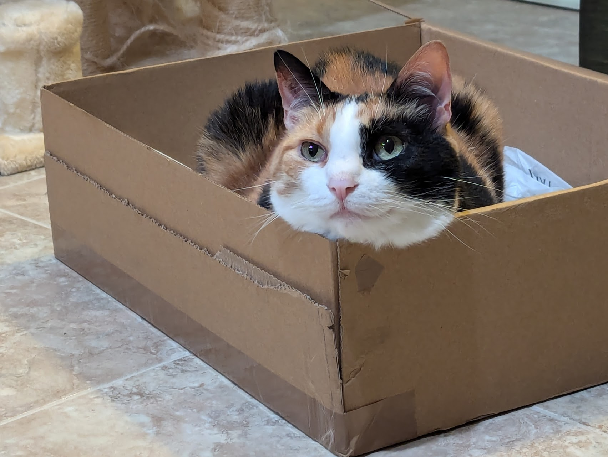
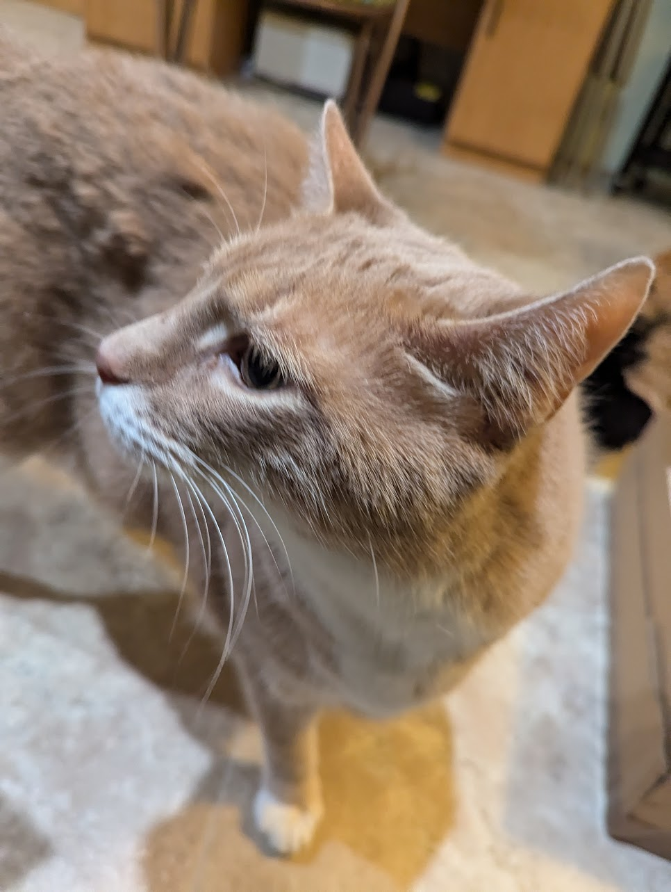

# Kosumi[1.0]: a Go Library
Parses SGF into an array of javascript objects. It's a work in progress as I learn the basics of JavaScript and programming in general. 

I'd like to create a Game class to store parsed SGF files, but I'm still figuring out how classes work in Javascript. Right now, the functions in parse.js can handle any Go SGF I've thrown at them!!

## To-do list:
- BIGBUG: allow 'tt' for passes
- smoler bug: allow for parsing of collections
- figure out how to better group sgf utility funcs and object utility funcs
- new AP sgf prop: put it in proper place. also, group root SGF props
- Allow compressing coords when generating SGF
- Syntax highlighting
- Basically rewrite everything in `game-logic.js` so it's not pure spaghetti, and add JSdoc while at it
- Implement Goban class.
    - Class functions:
        - `getNodesAtMove(moveNumber)` => returns array
        - `getNodesByCoord(coordinate)` => returns array
        - `getNodeById(nodeId)` => returns node
        - `getStates()` => sets .state for each node
        - `getVariation(nodeId)` => returns array of moves up to node
        - `makeMainBranch(nodeId)` => self-explanatory
        - `getSiblings(nodeId)` => returns array of sibling nodes
    - can nodes have functions?
        - `node.newCoord(coordinate)` => changes the coordinate in the node
        - `node.insert(node)` => parent becomes grandparent node, inserted node becomes parent
- Implement game logic >.>
- Try and use fewer loops in parse.js! 

## Credits:
the lovely, helpful, experienced, encouraging, friendly folks in the OGS forums for answering my endless questions about SGF and ebb'neffing

Discord friends for answering my similarly endless JavaScript questions, especially  purxiz the Patient 

## Bonus: 
Here are some pictures of my cats Denna and Kvothe

